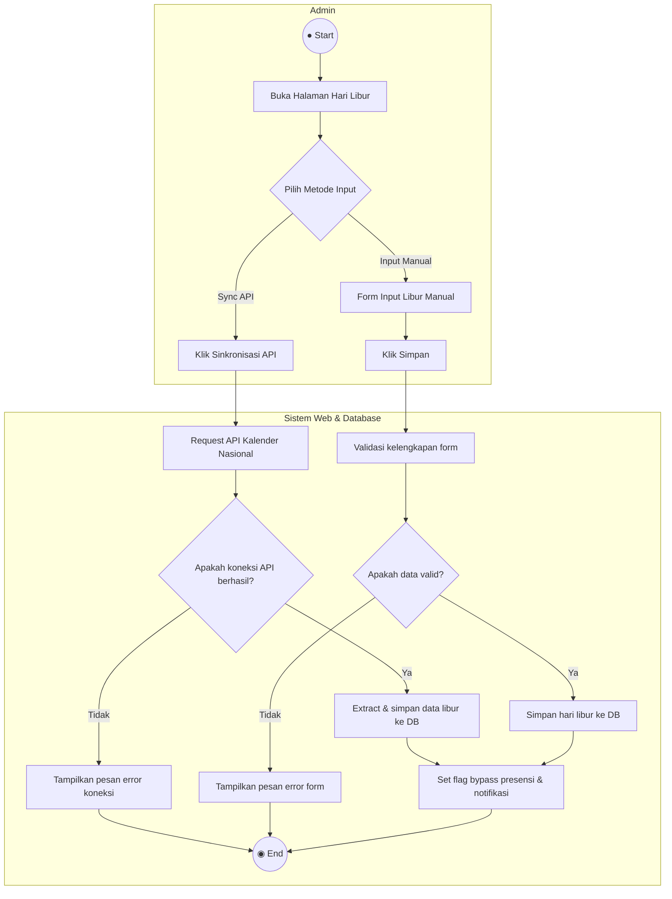
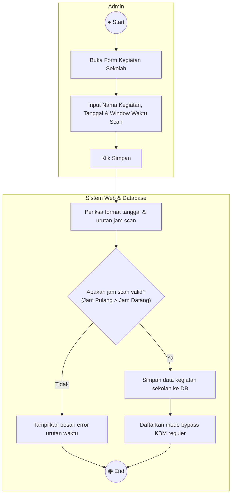
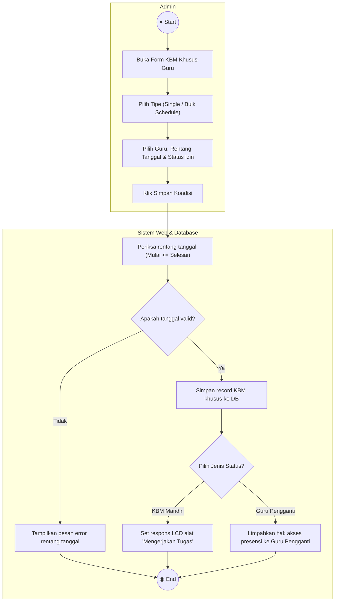
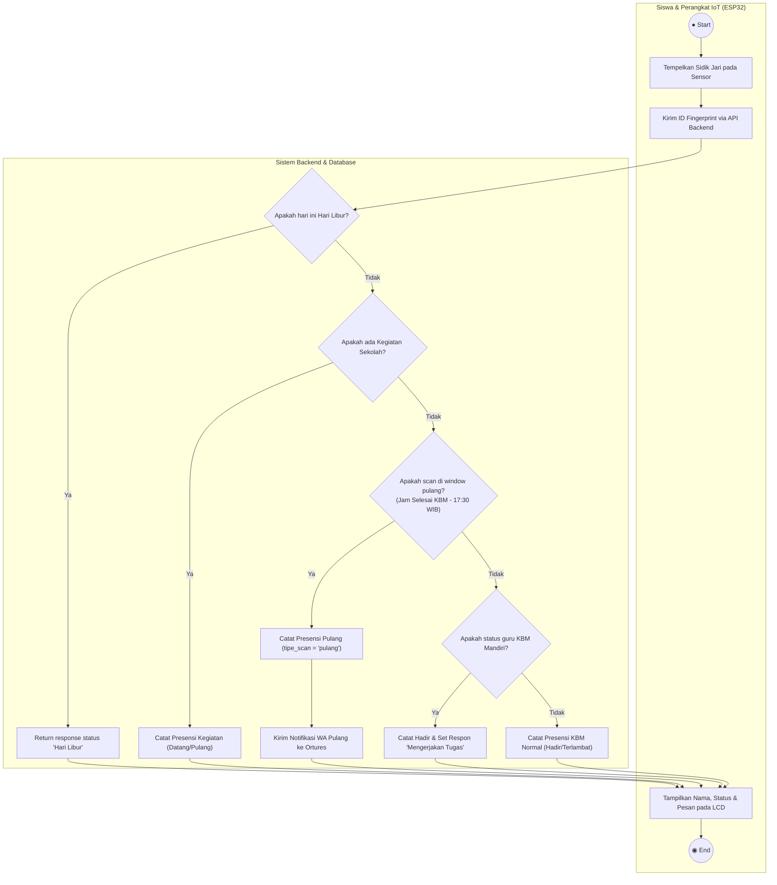
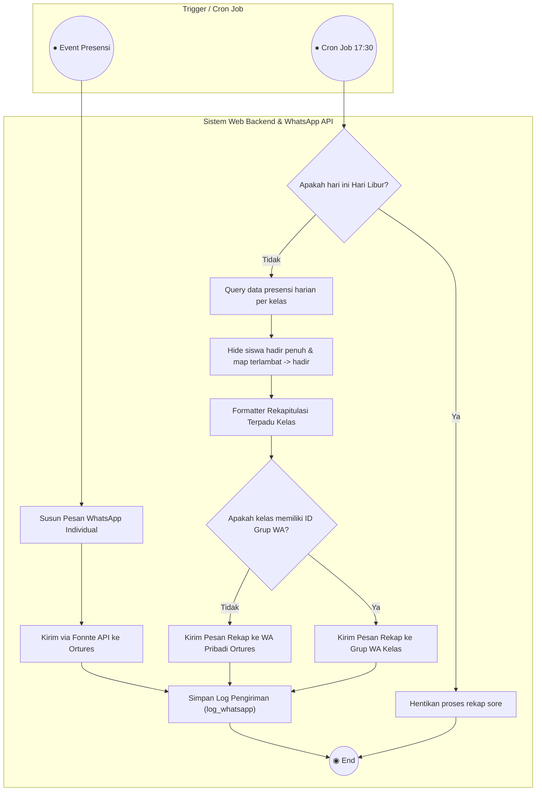

# Checklist Revisi Laporan Tugas Akhir (Bab III - Perancangan Sistem)

Dokumen ini memandu Anda dalam melakukan revisi **Bab III** pada file `LA-Revisi1.docx` agar selaras dengan fungsionalitas Fingersync terbaru pasca-revisi sidang.

---

## 📊 1. Use Case Diagram & Definisi Aktor
*Menyelaraskan peran aktor dan diagram fungsional sistem.*

- [x] **Revisi Gambar 3.2 (Use Case Diagram)**
  * Tambahkan 3 gelembung Use Case baru di sisi Admin:
    1. `Kelola Hari Libur`
    2. `Kelola Kegiatan Sekolah`
    3. `Kelola KBM Khusus Guru`
  * Hubungkan Aktor **Admin** ke tiga Use Case baru tersebut.
- [x] **Revisi Tabel 3.1 (Tabel Definisi Aktor)**
  * **Aktor Guru**: Tambahkan keterangan bahwa guru dapat bertindak sebagai Guru Utama maupun **Guru Pengganti** (menerima limpahan hak akses monitoring kelas temporer).
  * **Aktor Siswa**: Tambahkan keterangan bahwa interaksi fisik sidik jari siswa meliputi perekaman presensi **datang** (KBM) dan **pulang**.

---

## 📝 2. Tabel Definisi & Skenario Use Case
*Menjabarkan fitur baru secara tekstual.*

- [x] **Revisi Tabel 3.2 (Tabel Definisi Use Case)**
  * Salin deskripsi di bawah ini untuk ditambahkan/diperbarui pada Tabel 3.2 laporan Anda:
  
  | No | Use Case | Deskripsi | Aktor |
  | :--- | :--- | :--- | :--- |
  | **8** | Kelola Hari Libur | Proses di mana admin mengelola data hari libur sekolah secara manual atau menyinkronkannya secara otomatis melalui integrasi API Kalender Akademik Nasional. | Admin |
  | **9** | Kelola Kegiatan Sekolah | Proses di mana admin mengelola agenda kegiatan serentak sekolah (UTS, PORSENI) yang mem-bypass pencatatan KBM reguler pada perangkat fingerprint. | Admin |
  | **10** | Kelola KBM Khusus Guru | Proses di mana admin mengelola kondisi guru berhalangan hadir (Izin/KBM Mandiri) baik untuk jadwal tertentu maupun izin panjang (bulk). | Admin |
  | **13** | Autentikasi Fingerprint | Proses di mana siswa melakukan pemindaian sidik jari pada perangkat keras IoT untuk merekam kehadiran datang maupun pulang secara otomatis. | Siswa |
  | **14** | Kelola Presensi | Proses di mana admin atau guru memantau data kehadiran (termasuk filter status pulang virtual), serta melakukan koreksi data (tambah/ubah status) jika ada siswa yang izin, sakit, atau tidak masuk. | Admin, Guru |
  | **15** | Laporan Presensi | Proses di mana guru atau admin melihat rekapitulasi kehadiran (termasuk rekap jumlah AIS bulanan/semester) dan mencetak laporan presensi ke dalam format dokumen PDF/Excel. | Admin, Guru |
  | **16** | Peringatan via WhatsApp | Proses otomatis sistem mengirimkan notifikasi kehadiran (datang/pulang) siswa, serta mengirim rekapitulasi harian kelas secara terpadu ke Grup WhatsApp Kelas. | Sistem |
- [x] **Tambahkan Tabel Skenario Use Case Baru**
  * Di bawah ini adalah 3 tabel skenario use case baru untuk Anda salin ke laporan Anda (Tabel 3.3x):

  ### Skenario Use Case Kelola Hari Libur
  
  | Detail Skenario | Deskripsi |
  | :--- | :--- |
  | **Use Case** | Kelola Hari Libur |
  | **Aktor** | Admin |
  | **Deskripsi** | Mengelola hari libur nasional atau libur khusus sekolah agar sistem secara otomatis menolak validasi presensi sidik jari siswa pada perangkat keras IoT dan menonaktifkan rekap otomatis/input Alpha. |
  | **Kondisi Awal** | Admin berada di halaman utama Manajemen Hari Libur. |
  | **Kondisi Akhir** | Data hari libur sekolah berhasil diperbarui di database. |
  
  * **Skenario Normal**:
  
  | Aksi Aktor | Reaksi Sistem |
  | :--- | :--- |
  | 1. Admin memilih tombol "Sinkronisasi API Hari Libur Nasional". | 2. Sistem mengirim request ke API Kalender Akademik Nasional. |
  | | 3. Sistem mengunduh, mengurai, dan menyimpan data hari libur nasional tahun berjalan ke database, lalu menampilkan pesan sukses. |
  | 4. Admin mengisi form tambah libur sekolah secara manual (nama libur & tanggal) lalu mengeklik "Simpan". | 5. Sistem memvalidasi input, menyimpan hari libur baru ke database, dan memicu notifikasi sukses. |
  
  * **Skenario Gagal**:
  
  | Aksi Aktor | Reaksi Sistem |
  | :--- | :--- |
  | 1. Admin memilih tombol "Sinkronisasi API Hari Libur Nasional". | 2. Sistem mendeteksi kegagalan koneksi ke server API Kalender. |
  | | 3. Sistem membatalkan sinkronisasi dan menampilkan pesan kesalahan "Gagal menghubungkan ke Server API Kalender". |

  ---

  ### Skenario Use Case Kelola Kegiatan Sekolah
  
  | Detail Skenario | Deskripsi |
  | :--- | :--- |
  | **Use Case** | Kelola Kegiatan Sekolah |
  | **Aktor** | Admin |
  | **Deskripsi** | Mengelola agenda kegiatan serentak sekolah (seperti UTS atau Porseni) untuk menetapkan window waktu absen datang & pulang yang mem-bypass KBM reguler pada seluruh perangkat fingerprint. |
  | **Kondisi Awal** | Admin berada di form tambah Kegiatan Sekolah. |
  | **Kondisi Akhir** | Jadwal kegiatan sekolah baru berhasil terdaftar di database. |
  
  * **Skenario Normal**:
  
  | Aksi Aktor | Reaksi Sistem |
  | :--- | :--- |
  | 1. Admin memasukkan nama kegiatan, tanggal pelaksanaan, serta rentang jam scan datang & scan pulang kegiatan. | 2. Sistem memvalidasi kelengkapan data. |
  | 3. Admin mengeklik tombol "Simpan". | 4. Sistem menyimpan agenda kegiatan ke database dan mendaftarkan jadwal bypass presensi pada hari bersangkutan. |
  
  * **Skenario Gagal**:
  
  | Aksi Aktor | Reaksi Sistem |
  | :--- | :--- |
  | 1. Admin memasukkan data kegiatan dengan rentang jam scan pulang mendahului jam scan datang. | 2. Sistem memvalidasi masukan waktu dan mendeteksi ketidaksesuaian. |
  | 3. Admin mengeklik tombol "Simpan". | 4. Sistem membatalkan penyimpanan dan menampilkan pesan error "Waktu scan pulang tidak boleh mendahului waktu scan datang". |

  ---

  ### Skenario Use Case Kelola KBM Khusus Guru
  
  | Detail Skenario | Deskripsi |
  | :--- | :--- |
  | **Use Case** | Kelola KBM Khusus Guru |
  | **Aktor** | Admin |
  | **Deskripsi** | Menginput kondisi guru yang berhalangan hadir (Izin/KBM Mandiri) baik untuk satu jadwal pelajaran spesifik maupun izin panjang bulk (misal: umroh/sakit lama). |
  | **Kondisi Awal** | Admin berada di halaman form tambah KBM Khusus Guru. |
  | **Kondisi Akhir** | Status KBM Khusus Guru terdaftar dan respons alat fingerprint/notifikasi WA disesuaikan otomatis pada hari tersebut. |
  
  * **Skenario Normal**:
  
  | Aksi Aktor | Reaksi Sistem |
  | :--- | :--- |
  | 1. Admin memilih tipe izin (Single/Bulk), guru yang berhalangan, tanggal absen, jenis jadwal, status izin (Izin/Libur/Guru Pengganti), dan mengisi catatan. | 2. Sistem menampilkan daftar jadwal mengajar guru secara dinamis sesuai hari yang dipilih. |
  | 3. Admin mengeklik tombol "Simpan". | 4. Sistem menyimpan kondisi khusus guru ke database. Jika status KBM adalah "KBM Mandiri", sistem mendaftarkan respons "Mengerjakan Tugas" di alat presensi. Jika ditugaskan "Guru Pengganti", hak akses presensi dialihkan sementara ke guru pengganti tersebut. |
  
  * **Skenario Gagal**:
  
  | Aksi Aktor | Reaksi Sistem |
  | :--- | :--- |
  | 1. Admin memilih tipe Bulk, namun memasukkan tanggal selesai yang mendahului tanggal mulai. | 2. Sistem memvalidasi input tanggal dan mendeteksi ketidaksesuaian. |
  | 3. Admin mengeklik tombol "Simpan". | 4. Sistem membatalkan proses dan menampilkan pesan kesalahan "Tanggal selesai tidak boleh sebelum tanggal mulai". |

---

## 🔄 2.1. Activity Diagram (Bab III)
*Menyempurnakan alur kerja sistem (workflow) pada diagram aktivitas.*

- [ ] **Tambahkan 3 Gambar Activity Diagram Baru & 2 Revisi Activity Diagram**

---

### 1. Activity Diagram Kelola Hari Libur

**Deskripsi Laporan (Salin ke Bab III):**
> Diagram ini menggambarkan alur kerja pengurusan data hari libur sekolah dan sinkronisasi kalender akademik nasional. Aktivitas dimulai oleh Admin yang memilih opsi pengelolaan hari libur pada sistem. Admin dapat menambah hari libur manual atau memilih opsi sinkronisasi otomatis via API Kalender Akademik. Pada pilihan sinkronisasi API, sistem melakukan koneksi HTTP ke server API luar. Terdapat keputusan logika validasi: jika koneksi gagal, sistem menampilkan pesan galat. Jika berhasil, sistem mengurai data tanggal libur dan menyimpannya ke basis data. Data libur yang tersimpan ini kemudian secara otomatis dijadikan acuan oleh *backend* untuk mem-bypass pencatatan presensi sidik jari dan pengiriman notifikasi pada tanggal bersangkutan. Detail alur aktivitas ini dapat dilihat pada Gambar 3.xx.

*Gambar 3.xx Activity Diagram Kelola Hari Libur*

---

### 2. Activity Diagram Kelola Kegiatan Sekolah

**Deskripsi Laporan (Salin ke Bab III):**
> Diagram ini menggambarkan alur pendaftaran agenda kegiatan serentak sekolah seperti Ujian Tengah Semester (UTS) atau PORSENI. Proses diawali oleh Admin yang mengisi formulir kegiatan sekolah mencakup nama agenda, tanggal pelaksanaan, serta jendela waktu presensi datang dan presensi pulang. Data dikirimkan ke sistem untuk divalidasi. Apabila rentang jam scan tidak valid (misalnya jam scan pulang mendahului jam datang), sistem mengembalikan pesan galat. Apabila validasi berhasil, sistem menyimpan record kegiatan ke basis data dan mendaftarkan mode presensi khusus (bypass KBM reguler) untuk tanggal tersebut. Detail alur aktivitas ini dapat dilihat pada Gambar 3.xx.

*Gambar 3.xx Activity Diagram Kelola Kegiatan Sekolah*

---

### 3. Activity Diagram Kelola KBM Khusus Guru

**Deskripsi Laporan (Salin ke Bab III):**
> Diagram ini menggambarkan mekanisme pengelolaan kondisi khusus guru yang berhalangan hadir (Izin, KBM Mandiri, atau penugasan Guru Pengganti). Alur dimulai saat Admin memilih jenis penginputan (Single/Bulk) dan menentukan nama guru serta rentang tanggal. Sistem memvalidasi rentang waktu dan menampilkan daftar jadwal mengajar guru bersangkutan. Admin memilih status penanganan: jika memilih status KBM Mandiri, sistem mendaftarkan respons instruksi tugas pada alat presensi; jika memilih Guru Pengganti, sistem melimpahkan otorisasi pengelolaan presensi kelas kepada guru pengganti yang ditunjuk. Seluruh data disimpan ke dalam basis data. Detail alur aktivitas ini dapat dilihat pada Gambar 3.xx.

*Gambar 3.xx Activity Diagram Kelola KBM Khusus Guru*

---

### 4. Activity Diagram Autentikasi Fingerprint (Revisi Gambar 3.15)

**Deskripsi Laporan (Salin ke Bab III - Menggantikan Deskripsi Lama):**
> Diagram ini menggambarkan alur pemrosesan data biometrik sidik jari siswa pada perangkat keras IoT hingga ke server backend. Proses dimulai ketika siswa menempelkan jari pada sensor sidik jari ESP32. Perangkat mengirimkan ID sidik jari ke server API backend. Sistem terlebih dahulu mengecek status tanggal berjalan: jika tanggal merupakan Hari Libur, sistem mengembalikan respons penolakan "Hari Libur". Jika terdapat Kegiatan Sekolah, sistem mencatat presensi kegiatan (Datang/Pulang Kegiatan). Pada hari KBM normal, sistem mengecek jendela waktu: jika scan dilakukan setelah jam KBM berakhir hingga pukul 17:30 WIB, sistem mencatatnya sebagai Absen Pulang. Jika scan dilakukan pada jam KBM, sistem memvalidasi status guru; jika guru KBM Mandiri, perangkat menampilkan pesan "Mengerjakan Tugas". Data presensi berhasil disimpan dan respons dikirim kembali ke perangkat LCD. Detail alur aktivitas ini dapat dilihat pada Gambar 3.15.

*Gambar 3.15 Activity Diagram Autentikasi Fingerprint*

---

### 5. Activity Diagram Peringatan via WhatsApp (Revisi Gambar 3.18)

**Deskripsi Laporan (Salin ke Bab III - Menggantikan Deskripsi Lama):**
> Diagram ini menggambarkan mekanisme kerja pengiriman pesan notifikasi presensi real-time dan rekapitulasi harian terpadu. Proses diawali saat peristiwa presensi terekam (atau saat cron job jadwal tercapai). Untuk presensi individual (datang/pulang), sistem menyusun format pesan notifikasi real-time dan mengirimkannya ke nomor WhatsApp Orang Tua/Wali Murid via Fonnte Gateway API. Pada pukul 17:30 WIB, cron job sistem secara otomatis memicu pembuatan laporan rekapitulasi harian kelas. Sistem mengambil seluruh data presensi harian, mengelompokkannya per kelas, menyembunyikan siswa yang hadir penuh, dan memetakan status terlambat menjadi Hadir. Pesan rekapitulasi terpadu disusun dan dikirimkan secara otomatis langsung ke Grup WhatsApp Kelas. Detail alur aktivitas ini dapat dilihat pada Gambar 3.18.

*Gambar 3.18 Activity Diagram Peringatan via WhatsApp*

---

## 🗄️ 3. Perancangan Basis Data (Class Diagram & Skema Tabel)
*Menyesuaikan struktur data laporan dengan struktur tabel fisik database.*

- [x] **Revisi Class Diagram (Gambar 3.x) & Relasi Tabel**
  * Selesai (Penjelasan relasi antartabel baru sudah tercantum di atas).
- [x] **Tambahkan Skema Tabel Baru (Tabel Detail Atribut)**
  * Salin teks paragraf deskripsi dan format tabel di bawah ini langsung ke laporan Word Anda:

  ---

  ### 1. Tabel hari_liburs (Tabel Baru)

  Tabel ini digunakan untuk menyimpan data hari libur sekolah (baik libur nasional resmi PHBN/PHBI maupun libur khusus sekolah). Tabel ini bersifat mandiri (independen) dan tidak memiliki relasi *foreign key* langsung ke tabel lain karena berlaku secara global untuk seluruh civitas akademika pada tanggal tersebut. Struktur tabel secara detail dapat dilihat pada Tabel 3.37.

  **Tabel 3. 37 Tabel hari_liburs**

  | No. | Nama Field | Tipe Data | Ukuran | Keterangan |
  | :--- | :--- | :--- | :--- | :--- |
  | 1 | id | BIGINT | 20 | Primary key |
  | 2 | nama | VARCHAR | 255 | Nama hari libur nasional / sekolah |
  | 3 | tanggal_mulai | DATE | - | Tanggal mulainya hari libur |
  | 4 | tanggal_selesai | DATE | - | Tanggal berakhirnya hari libur |
  | 5 | jenis | ENUM | - | Jenis libur ('nasional', 'sekolah') |
  | 6 | keterangan | TEXT | - | Deskripsi detail / catatan libur (nullable) |
  | 7 | created_at | TIMESTAMP | - | Waktu record data dibuat |
  | 8 | updated_at | TIMESTAMP | - | Waktu record data diperbarui |

  ---

  ### 2. Tabel kegiatan_sekolah (Tabel Baru)

  Tabel ini digunakan untuk menyimpan agenda kegiatan serentak sekolah (seperti Ujian Tengah Semester, Ujian Akhir Semester, atau PORSENI) yang mem-bypass pencatatan KBM reguler. Tabel ini memiliki relasi *One-to-Many* terhadap tabel *presensi* melalui kolom *id_kegiatan_sekolah*. Struktur tabel secara detail dapat dilihat pada Tabel 3.38.

  **Tabel 3. 38 Tabel kegiatan_sekolah**

  | No. | Nama Field | Tipe Data | Ukuran | Keterangan |
  | :--- | :--- | :--- | :--- | :--- |
  | 1 | id | BIGINT | 20 | Primary key |
  | 2 | nama_kegiatan | VARCHAR | 255 | Nama agenda kegiatan sekolah |
  | 3 | tanggal | DATE | - | Tanggal pelaksanaan kegiatan |
  | 4 | tipe | VARCHAR | 255 | Kategori kegiatan (default: 'serentak') |
  | 5 | jam_mulai_datang | TIME | - | Jam mulai scan datang (default: '06:30:00') |
  | 6 | jam_selesai_datang | TIME | - | Jam selesai scan datang (default: '09:00:00') |
  | 7 | jam_mulai_pulang | TIME | - | Jam mulai scan pulang (default: '12:00:00') |
  | 8 | jam_selesai_pulang | TIME | - | Jam selesai scan pulang (default: '16:00:00') |
  | 9 | keterangan | TEXT | - | Catatan penjelasan kegiatan (nullable) |
  | 10 | created_at | TIMESTAMP | - | Waktu record data dibuat |
  | 11 | updated_at | TIMESTAMP | - | Waktu record data diperbarui |

  ---

  ### 3. Tabel guru_kbm_khusus (Tabel Baru)

  Tabel ini digunakan untuk menyimpan catatan kondisi KBM khusus ketika guru mata pelajaran utama berhalangan hadir (seperti izin biasa, penugasan KBM mandiri, atau penunjukan guru pengganti). Tabel ini memiliki relasi *Many-to-One* terhadap tabel *rombel_jadwal_pelajaran* melalui kolom *id_rombel_jadwal_pelajaran* dan terhadap tabel *guru* melalui kolom *id_guru_pengganti*. Struktur tabel secara detail dapat dilihat pada Tabel 3.39.

  **Tabel 3. 39 Tabel guru_kbm_khusus**

  | No. | Nama Field | Tipe Data | Ukuran | Keterangan |
  | :--- | :--- | :--- | :--- | :--- |
  | 1 | id | BIGINT | 20 | Primary key |
  | 2 | id_rombel_jadwal_pelajaran | BIGINT | 20 | FK ke table rombel_jadwal_pelajaran |
  | 3 | tanggal | DATE | - | Tanggal guru berhalangan hadir |
  | 4 | status | VARCHAR | 255 | Status penanganan ('izin', 'absen', 'diganti') |
  | 5 | id_guru_pengganti | BIGINT | 20 | FK ke table guru (nullable) |
  | 6 | keterangan | TEXT | - | Catatan/instruksi tugas guru (nullable) |
  | 7 | created_at | TIMESTAMP | - | Waktu record data dibuat |
  | 8 | updated_at | TIMESTAMP | - | Waktu record data diperbarui |

  ---

  ### 4. Tabel kelas (Tabel Diubah)

  Tabel ini digunakan untuk menyimpan data nama kelas dan tingkat rombongan belajar siswa. Pada pengembangan ini, dilakukan perubahan berupa penambahan satu atribut baru yaitu *id_grup_wa* yang digunakan untuk memetakan identitas unik (ID) Grup WhatsApp kelas dari Fonnte API guna memicu pengiriman rekapitulasi harian terpadu kelas secara otomatis. Struktur tabel secara detail dapat dilihat pada Tabel 3.25.

  **Tabel 3. 25 Tabel kelas (Ter-Update)**

  | No. | Nama Field | Tipe Data | Ukuran | Keterangan |
  | :--- | :--- | :--- | :--- | :--- |
  | 1 | id | BIGINT | 20 | Primary key |
  | 2 | nama | VARCHAR | 255 | Nama rombongan belajar kelas |
  | 3 | id_jurusan | BIGINT | 20 | FK ke table jurusan |
  | 4 | **id_grup_wa** | **VARCHAR** | **255** | **[Baru] ID Grup WhatsApp Fonnte (nullable)** |
  | 5 | created_at | TIMESTAMP | - | Waktu record data dibuat |
  | 6 | updated_at | TIMESTAMP | - | Waktu record data diperbarui |

  ---

  ### 5. Tabel presensi (Tabel Diubah)

  Tabel ini digunakan untuk mencatat riwayat log kehadiran siswa baik pada jam KBM mata pelajaran biasa maupun saat kegiatan sekolah serentak. Pada pengembangan ini, dilakukan perubahan struktur berupa penambahan kolom tipe scan, relasi baru ke tabel kegiatan sekolah, serta melonggarkan batasan kolom jadwal pelajaran menjadi opsional (*nullable*) agar dapat mencatat presensi pulang sekolah dan kegiatan. Struktur tabel secara detail dapat dilihat pada Tabel 3.33.

  **Tabel 3. 33 Tabel presensi (Ter-Update)**

  | No. | Nama Field | Tipe Data | Ukuran | Keterangan |
  | :--- | :--- | :--- | :--- | :--- |
  | 1 | id | BIGINT | 20 | Primary key |
  | 2 | id_rombel_jadwal_pelajaran | BIGINT | 20 | FK ke table rombel_jadwal_pelajaran (diubah menjadi Nullable) |
  | 3 | id_siswa | BIGINT | 20 | FK ke table siswa |
  | 4 | tanggal | DATE | - | Tanggal pelaksanaan presensi |
  | 5 | jam | TIME | - | Jam pemindaian sidik jari pada alat |
  | 6 | status | VARCHAR | 255 | Status kehadiran (Hadir, Terlambat, Sakit, Izin, Alpha) |
  | 7 | **tipe_scan** | **VARCHAR** | **255** | **[Baru] Tipe scan presensi ('datang', 'pulang')** |
  | 8 | **id_kegiatan_sekolah** | **BIGINT** | **20** | **[Baru] FK ke table kegiatan_sekolah (nullable)** |
  | 9 | **tipe_scan_kegiatan** | **VARCHAR** | **255** | **[Baru] Tipe scan kegiatan ('datang', 'pulang') (nullable)** |
  | 10 | created_at | TIMESTAMP | - | Waktu record data dibuat |
  | 11 | updated_at | TIMESTAMP | - | Waktu record data diperbarui |
